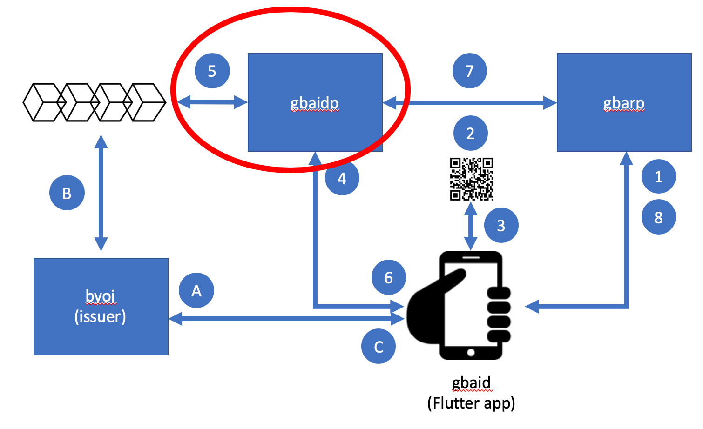

# gbaidp

*************************
YOU MUST rvm ruby-2.3.3 FIRST!!!
*************************

# OpenIDConnect Sample

A sample OpenID Connect Provider ("OP") using the `openid_connect` gem.

## Resources

For this sample:

* View source on GitHub: https://github.com/nov/openid_connect_sample
* Report Issues on GitHub: https://github.com/nov/openid_connect_sample/issues

For more information, see readme and wiki for `openid_connect` gem:

* https://github.com/nov/openid_connect

Also of interest, the corresponding sample RP:

* https://github.com/nov/openid_connect_sample_rp

## How to Run This Example on Your Machine

### Localhost

To run this in development mode on your local machine:

* Download (or fork or clone) this repo
* `bundle install` (see "Note" section below if you get "pg"-gem-related problems)
* `bundle exec rake db:create db:migrate db:seed` (you have SQLite installed, right?)
* modify `config/connect/id_token/issuer.yml` -- change `issuer` to http://localhost:3000
* `bundle exec rails server -p 3000`

Point your browser at http://localhost:3000

If you download and run [the sample RP server](https://connect-rp.herokuapp.com),
you can have it use this OP (use `localhost:3000` in the "Discover" field).
The two servers on localhost must run on different ports.

Obviously, external servers will not be able to connect to an OP that is running on localhost.

### On a public server

To run it on a public server, the steps are the same as for localhost, except
you will set `issuer` in the issuer.yml config file to your domain name.

Once it's running, you can use [Nov's Sample RP on Heroku](https://connect-rp.herokuapp.com)
to discover and connect to it.

## Notes

* The Gemfile includes gem 'pg' (for PostgreSQL), but you can remove it.
  Nov uses PostgreSQL for his Heroku deployment, but the default DB configs are all SQLite.
* The Facebook link won't work unless you register your app with them.

## Centos OpenSSL Complications

Centos' default OpenSSL package does not include some Elliptic Curve algorithms for patent reasons.
Unfortunately, the gem dependency `json-jwt` calls on one of those excluded algorithms.

If you see `uninitialized constant OpenSSL::PKey::EC` when you try to run the server,
this is your problem. You need to rebuild OpenSSL to include those missing algorithms.

This problem is beyond the scope of this README, but
[this question on StackOverflow](http://stackoverflow.com/questions/32790297/uninitialized-constant-opensslpkeyec-from-ruby-on-centos/32790298#32790298)
may be of help.

## Copyright

Copyright (c) 2011 nov matake. See LICENSE for details.
